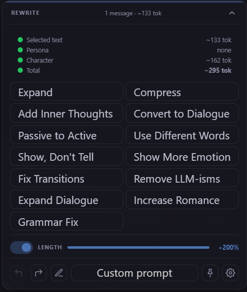
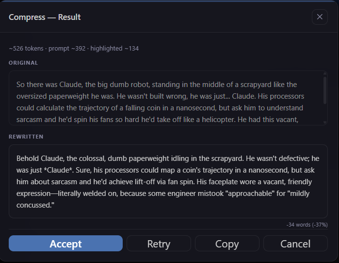
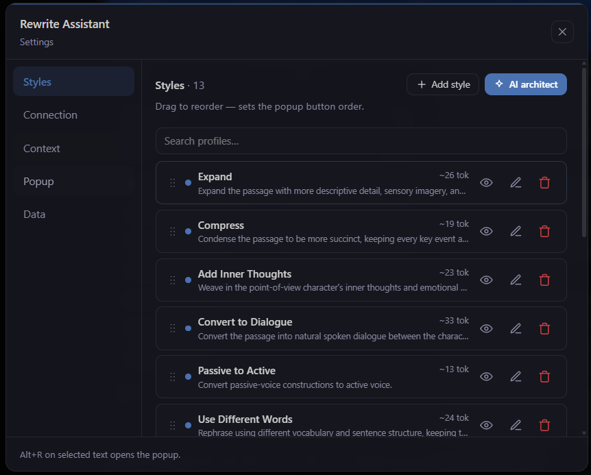
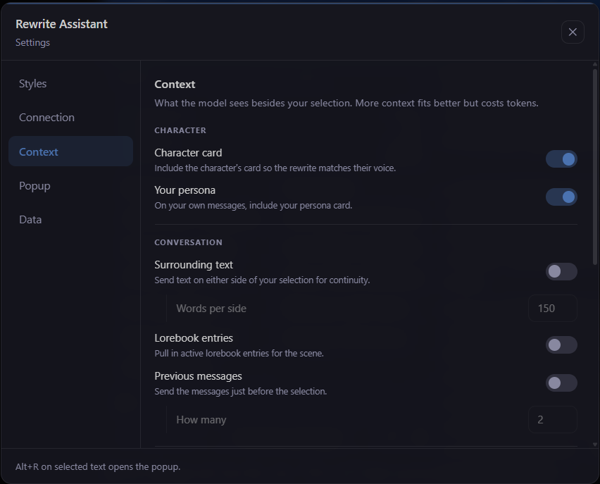
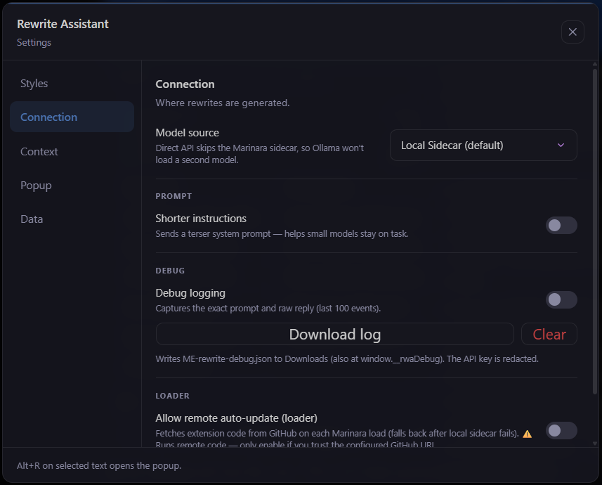

# Marinara Rewrite

An extension for [Marinara Engine](https://github.com/SillyTavern/Marinara-Engine) that rewrites a selected
section of text in a message using an AI model. Select text, choose a mode, and the selection is replaced in place.

## Screenshots

| Rewrite popup | Result with diff |
| --- | --- |
|  |  |







## Features

### Rewrite styles

- **13 built-in modes:** Expand, Compress, Add Inner Thoughts, Convert to Dialogue, Passive to Active, Use
  Different Words, Show Don't Tell, Show More Emotion, Fix Transitions, Remove LLM-isms, Expand Dialogue, Increase
  Romance, Grammar Fix.
- **Custom prompt** — a one-off instruction entered at the time of use. **AI Refine** turns a rough note
  ("bigger, longer") into a clear instruction; **Save as profile** promotes it to a permanent popup button.
- **AI Prompt Architect** — describe a style in plain language; the model produces a reusable profile.
- **Auto-profiles** — generates a profile matched to the current character's voice on chat switch, pinned at the
  top of the popup.

### The popup

- **Token-cost panel** — per-source token estimates (selection, surrounding text, persona, character, lorebook,
  previous messages, Extender memory) with a live total. Estimates are fetched locally and cached; no model call.
  - Empty dot = counting, green = counted. **Click a dot to exclude** that source from the next rewrite (turns
    red); the total updates and it is dropped from the prompt. Per-popup, resets on the next selection.
  - Collapsible (`^`), with the selection's token count shown in the header.
- **Trim before sending** — edit or trim the selected text before rewriting (single-message selections), with a
  hint when the edit strays from the original so the result can still be applied.
- **Movable and pinnable** — drag the popup by the bottom-corner grips; pin it to lock where it appears for later
  selections.
- **Copy** the result for manual paste, and a **manual-trigger-only** mode (`Alt+R`, no popup on selection).

### Context sources

- Surrounding text (configurable word count), previous messages, lorebook entries, and one or more character cards.
- **Your persona** on your own (user-authored) messages, plus **speaker-aware editing** that frames the rewrite as
  the author versus a character's voice.
- **Marinara Extender memory** — pulls a character's live memory from the
  [Marinara Extender](https://github.com/TCLowe1982/Marinara-Extender) sidecar, falling back to its persisted
  lorebook entries when the server isn't reachable.
- Any source can be excluded for a single rewrite from the popup's token panel.

### Connection

- The built-in **Marinara sidecar**, the **Marinara Extender** proxy (one local model serves rewrites and memory),
  or a **direct OpenAI-compatible API** (Ollama, LM Studio, llama.cpp, etc.).
- For direct mode: endpoint **presets** for common local servers, a **Discover models** button, optional API key,
  and a temperature control.

### Editing and applying

- **Length control** — a slider that converts the target into an explicit word-count range (small models handle
  this far better than a percentage). A **concise system-prompt** option trims tokens further for small models.
- **Multi-message rewrites** — a selection spanning several messages is rewritten one at a time, or merged into a
  single pass.
- **Large selections via the Ledger Pattern** — a selection too big for the model's context is windowed into slices
  (~1/6 of the configured context size), rewritten one at a time against a durable, resumable ledger (review,
  retry, or skip each slice), then assembled and applied in a single splice — instead of being truncated. Set the
  model's context size in Settings → Connection.
- **Undo and redo**, **cancellable** generation (aborts the in-flight request), and a **manual-save** mode that
  leaves the editor open so you confirm before committing.
- **Occurrence-targeted splice** — when the selected text appears more than once in a message, the rewrite targets
  the occurrence you selected.

### Management

- Per-profile color coding, drag-to-reorder, and **hide from the popup** (keeps the profile, removes its button).
- **Search** on the Profiles and Characters lists.
- **Selective export/import** — choose whether to include profiles, settings, custom prompts, and auto-profiles.
- **Debug log** — exportable record of prompts and replies for troubleshooting (API key redacted).
- All settings persist between sessions.

## Install

Two options:

- **Full bundle (no auto-update):** download [`rewrite-assistant.json`](rewrite-assistant.json), open the
  Extensions panel in Marinara Engine, and import it.
- **Auto-update loader:** import [`rewrite-assistant-loader.json`](rewrite-assistant-loader.json) once. It pulls the
  latest extension on every Marinara load (local Extender sidecar → GitHub → offline cache), so future updates only
  need a reload.

Then enable the extension. Select text in any message, or press `Alt+R`, to open the rewrite popup.

The unbundled source is in [`extension.js`](extension.js); the loader source is in [`loader.js`](loader.js).

## Direct API configuration

By default the extension uses the Marinara sidecar. To use a local OpenAI-compatible endpoint instead:

1. Open Settings → Connection and select Direct API.
2. Set the URL (use a preset, or e.g. `http://localhost:11434/v1` for Ollama), then **Discover models** or type the
   model name. Add an API key if your server requires one.
3. Use Test Connection to verify.

When using Ollama from the browser, start it with `OLLAMA_ORIGINS=*` to permit cross-origin requests.

## Credits

This release builds on two community forks, with thanks to both authors:

- **MrsKieu1102** — their r-w-a v2-3 build seeded several features that were reworked to fit this extension:
  user-persona / voice-matching context, local model discovery, the edit-only (manual) trigger, speaker-aware
  editing, and redo.
- **TCLowe1982** — their [Marinara-Rewrite fork](https://github.com/TCLowe1982/Marinara-Rewrite) contributed the
  Marinara Extender memory source and connection mode, cancellable rewrites, the large-text Ledger Pattern
  (windowed, resumable rewrites), the auto-update loader and build pipeline, and splice-reliability fixes
  (occurrence-targeted matching, multi-paragraph anchors, and correct lorebook scan handling). TCLowe also ported
  the speaker-aware editing and redo features from MrsKieu1102's build.

## Limitations

The model generates the rewrite; the extension then has to locate your selected text inside the stored message
and splice the new text in. Most failures happen at that second step, not the generation step.

- **The selection can't be located in the stored message.** The text shown on screen does not always match what
  is stored byte-for-byte: Markdown markers (`*emphasis*`, `_italics_`, `` `code` ``), list bullets, and the blank
  lines between paragraphs are common sources of mismatch. The extension tries several matching passes (exact, then
  whitespace-flexible, then first/last-word anchors that span line breaks, then a Markdown-tolerant word match)
  before giving up, but a selection that straddles formatting boundaries can still miss.
- **Output quality depends entirely on the configured model.** Small local models in particular may ignore the
  length target, leak the surrounding context into the rewrite, or return commentary instead of just the passage.
- **Context costs tokens and attention.** Enabling surrounding text, previous messages, lorebook entries, Extender
  memory, and multiple character cards all at once produces a large prompt that weaker models handle poorly — use
  the popup's token panel to see the cost and exclude sources you don't need for a given rewrite.

## Troubleshooting

**A rewrite failed to apply ("Could not locate the selected text").**

- Re-select within a single paragraph. Avoid grabbing the blank line between paragraphs.
- Avoid starting or ending the selection on a formatting marker or a list bullet; select the words, not the `*`/`_`.
- Use the popup's **trim** flyout to tidy the selection before sending.
- Enable **Settings → Behaviour → Leave editor open (save manually)**. The rewrite is placed in the editor and you
  save it yourself with `Ctrl+Enter`, so you can confirm it landed before committing.
- As a fallback, use **Copy** in the result dialog and paste the rewrite in manually.

**The rewrite applied but the message didn't change / reverted.**

- The save did not register. Use the manual-save mode above and confirm with `Ctrl+Enter`.
- Use **Undo** (in the popup) to roll back, or **Redo** to re-apply; history depth is configurable in Settings.

**Output is low quality, wrong length, or includes the surrounding text.**

- Turn off context sources you don't need (in the popup token panel, or **Settings → Context**); fewer inputs help
  weaker models stay on task.
- Enable the **concise system prompt** (Settings → Behaviour) on small / short-context models.
- In Direct API mode, lower the temperature (Settings → Connection) for more faithful, less inventive edits.

**Direct API / Extender errors, or "Test connection" fails.**

- Confirm the URL, model name, and key in Settings → Connection, then use **Test Connection** or **Discover
  models**.
- For Ollama, start it with `OLLAMA_ORIGINS=*` so the browser is allowed to call it.

**Diagnosing anything else.** Enable the debug log (Settings) to capture the exact prompts and replies, then
export it. The API key is redacted from the export.

## Development

Source is `extension.js` (the extension) and `loader.js` (the auto-update loader). A runnable check covers the
non-trivial logic (URL normalization, API response shaping, length-control math, prompt assembly order, debug ring
buffer, and drift guards):

```sh
node selfcheck.mjs
```

Build the installable bundles from source (runs selfcheck first, then writes `rewrite-assistant.json` and
`rewrite-assistant-loader.json`):

```sh
node build.mjs
```

## License

[MIT](LICENSE)
